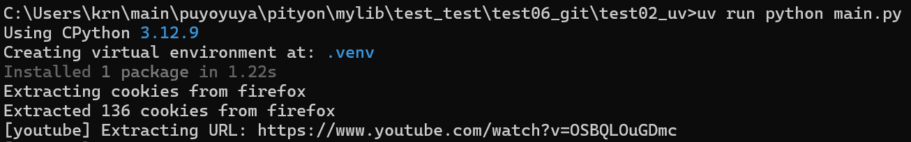

# テスト用 パッケージ管理ツール: **uv**を利用したリポジトリ

1. test02_uvフォルダーを作成(このフォルダーをプロジェクトとする)
2. uv initでgitとかの環境構築ができる
   .gitignoreにpycとか.venvを除外できるのが良い
4. 今の状態をmainブランチとして保存し、featureブランチでyt-dlpをuv addして開発
5. プルリクでfeatureをmainにマージした。とても気分がいい。ちゃんとignoreして欲しいファイル・フォルダーはignoreされている。

# 「気づいて」しまったこと
1. uv syncしなくても実行してライブラリがなかったら勝手にuv addしてくれるじゃんアゼルｐ

2. VSCodeの検索の除外設定として機能するの初めて知った。logとかも除外すればスッキリするのかなーとか妄想してみたり
